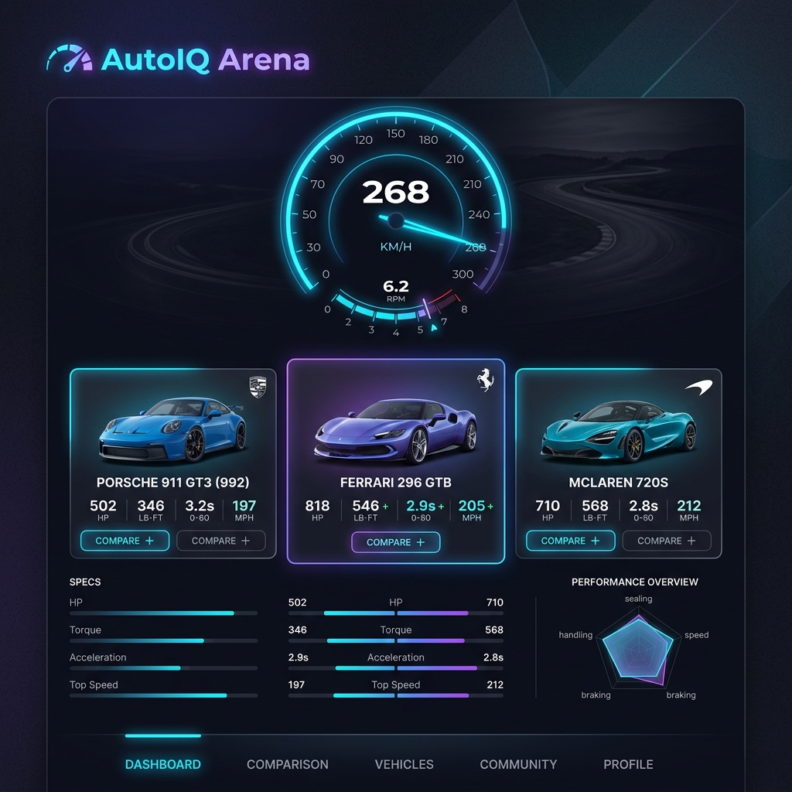
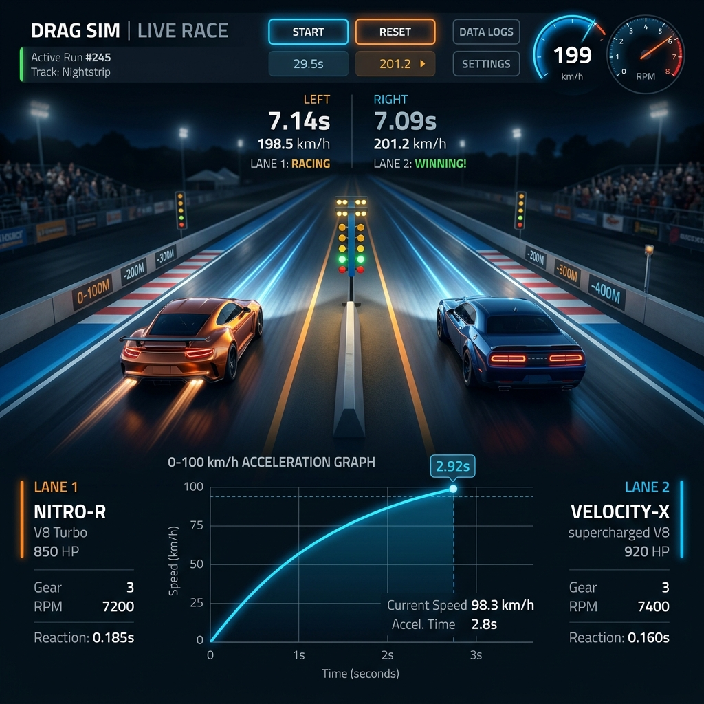
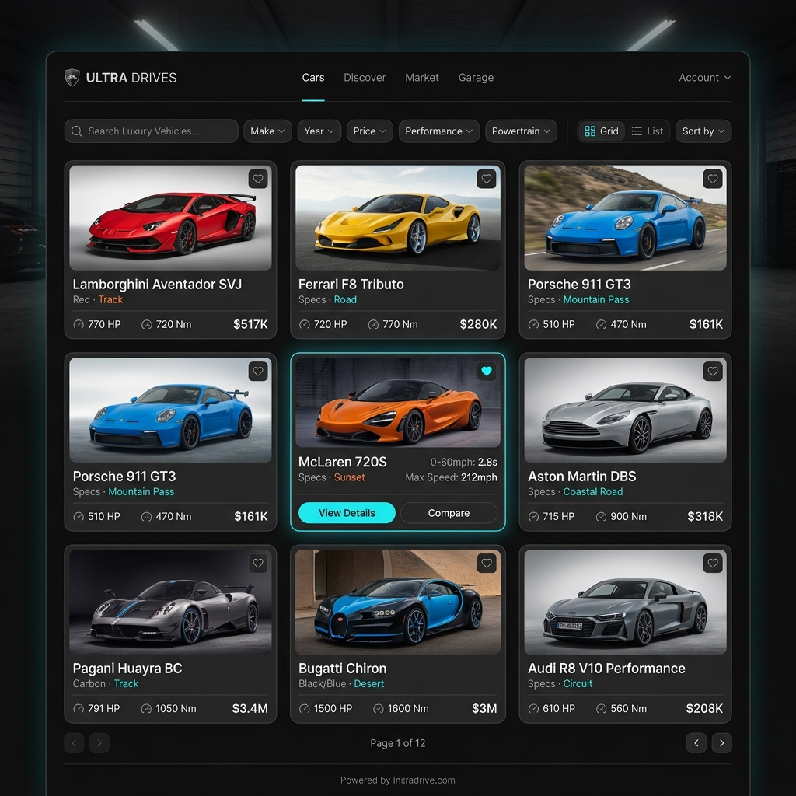

# 🏎️ AutoIQ Arena

**AutoIQ Arena** is a premium, high-fidelity car comparison and enthusiast platform. Built with a focus on dark-themed aesthetics, glassmorphism, and dynamic animations, the application provides an immersive experience for automotive enthusiasts to explore, compare, and simulate performance metrics.

## 🌟 Features

- **Dynamic Interactive Dashboard**: Explore curated selections of luxury and sports cars with sleek UI components.
- **Performance Simulator**: A drag race visualizer and 0-100 km/h acceleration graph equipped with dynamic speedometer gauges.
- **Rich Car Database**: Detailed grid views showcasing technical specifications like horsepower, torque, and top speeds.
- **Dark Mode & Glassmorphism Aesthetics**: Designed for user engagement with vibrant neon accents and premium look-and-feel.

## 📸 Screenshots

### The Dashboard


### Performance Simulator


### Car Database Grid


## 🚀 Getting Started

### Prerequisites
- Node.js (v16+)
- npm or yarn

### Installation
1. Clone the repository:
   ```bash
   git clone https://github.com/bhumiadi23/autoiq-arena.git
   ```
2. Navigate to the project directory:
   ```bash
   cd autoiq-arena
   ```
3. Install dependencies:
   ```bash
   npm install
   ```
4. Start the development server:
   ```bash
   npm run dev
   ```

## 🛠️ Tech Stack
- React 18
- Vite
- Tailwind CSS
- Framer Motion
- Recharts
- TypeScript

## 📄 License
This project is open-source and available under the standard MIT License.
